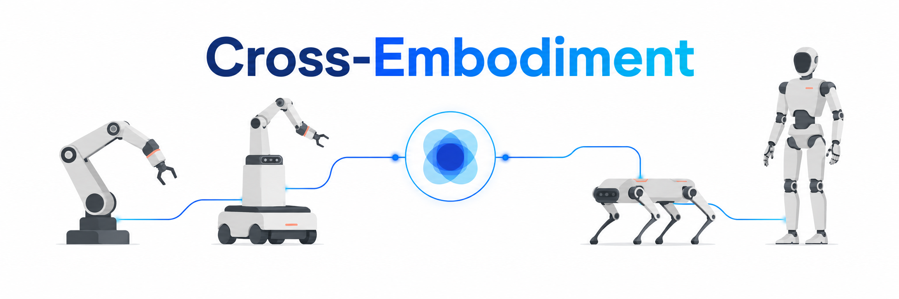
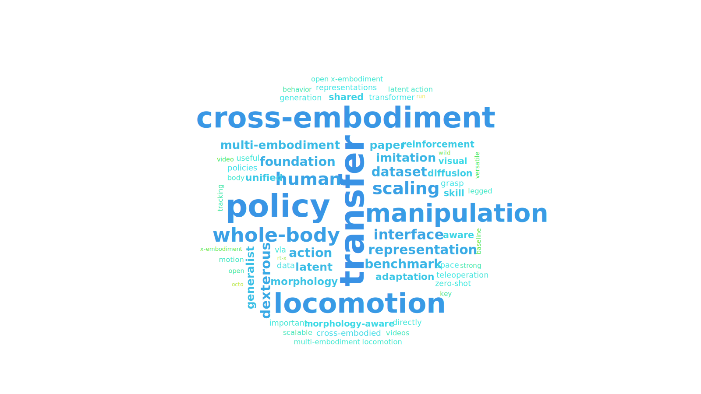
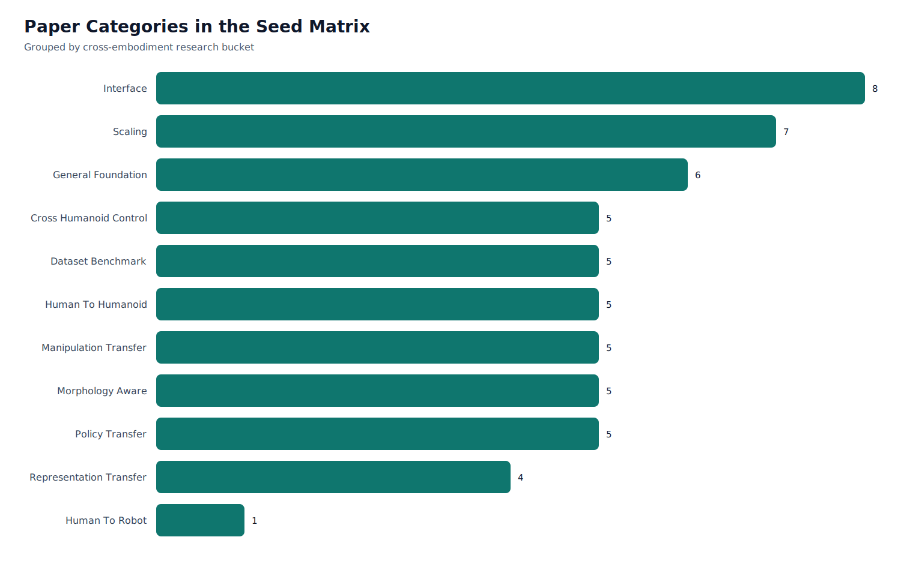
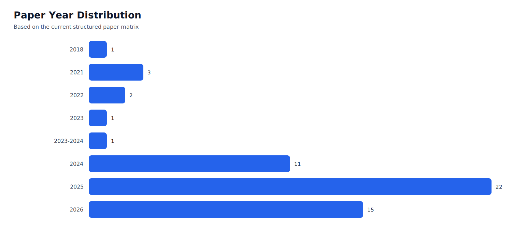

# Awesome Cross-Embodiment Robotics Learning [](https://awesome.re)   



An awesome list for **cross-embodiment robotics learning**.

This repository covers research on:

- **policy transfer across embodiments**
- **human-to-robot and human-to-humanoid transfer**
- **shared-policy / one-policy learning**
- **representation transfer and skill abstraction**
- **morphology transfer and embodiment conditioning**
- **unified action / interface design**
- **multi-embodiment datasets, benchmarks, and scaling laws**

Humanoids are a major focus, but **not the boundary**. If a paper helps answer how policies, representations, rewards, or data can transfer across different robot bodies, it belongs here.

## Why this repository

Most robot learning awesome lists are organized by task:

- locomotion
- manipulation
- navigation
- teleoperation

That is useful, but it misses the main question behind this repository:

> What actually transfers across embodiments, and how do we build robot learning systems that can reuse knowledge across different bodies?

This repository is organized around that question.

Instead of only asking *what task a paper solves*, we also ask:

- What is **shared** across embodiments?
- What stays **embodiment-specific**?
- Is the method really **cross-embodiment**, or just multi-task on one body?
- Does it transfer to **unseen embodiments**?
- What is the **observation/action interface**?
- Is the transferable signal from **human data**, **robot data**, **simulation**, or **morphology structure**?

## Quick Stats

| Item | Current Scope |
| --- | --- |
| Primary theme | Cross-embodiment robotics learning |
| Main emphasis | Transfer, shared policy, shared representation, unified interface |
| Core robot families | Humanoids, bipeds, manipulators, mobile manipulators, legged systems |
| Seed paper matrix | 50+ entries |
| Supporting docs | Reading guide, taxonomy, note template, paper matrix |

## Visual Overview

### Word Cloud of Paper Titles



### Category Distribution



### Year Distribution



## Featured Must-Reads

If you only have time for a small starter set, begin here.

| Paper | Why it matters |
| --- | --- |
| [Open X-Embodiment / RT-X](https://robotics-transformer-x.github.io/) | The default starting point for large-scale multi-embodiment robot learning. |
| [Octo](https://arxiv.org/abs/2405.12213) | A practical open-source generalist policy baseline. |
| [Being-H0.5](https://arxiv.org/abs/2601.12993) | Strong recent framing for human traces as universal embodied priors. |
| [Humanoid Policy ~ Human Policy](https://arxiv.org/abs/2503.13441) | One of the clearest human-to-humanoid cross-embodiment papers. |
| [H-Zero](https://arxiv.org/abs/2512.00971) | Directly relevant to unseen humanoid embodiment transfer. |
| [XHugWBC](https://arxiv.org/abs/2602.05791) | One of the closest works to shared policy across multiple humanoids. |
| [CEI](https://arxiv.org/abs/2601.09163) | A very clean take on cross-embodiment interface design. |
| [Latent Action Diffusion](https://arxiv.org/abs/2506.14608) | Shows why a good latent action space can matter more than raw action alignment. |

## Research Taxonomy

The main value of this repository is its taxonomy.

| Category | Core Question |
| --- | --- |
| Problem Formulations and Transfer Taxonomy | What counts as real cross-embodiment learning? |
| General Multi-Embodiment Foundations | Can large-scale shared training produce transferable embodied intelligence? |
| Policy Transfer, Distillation, and Fast Adaptation | How do we reuse a policy across bodies? |
| Representation Transfer, Skill Abstraction, and World Models | What latent structures are embodiment-invariant? |
| Human-to-Robot and Human-Prior Transfer | Can human behavior become robot prior knowledge? |
| Cross-Embodiment Locomotion and Whole-Body Control | Can locomotion or whole-body control transfer across humanoids and bipeds? |
| Cross-Embodiment Manipulation, Visual Imitation, and Retrieval | What transfers in manipulation when bodies differ? |
| Unified Interfaces, Latent Actions, and Retargeting | What is the right shared action or control interface? |
| Teleoperation and Data Collection Systems | How do we collect aligned cross-embodiment data at scale? |
| Datasets and Benchmarks | How do we evaluate cross-embodiment claims rigorously? |
| Morphology-Aware Learning and Scaling Laws | Should we explicitly model morphology, and how does embodiment diversity scale? |
| Strong Auxiliary Baselines | What strong single-body or adjacent-body baselines should we compare against? |

Detailed taxonomy notes: [docs/research-taxonomy.md](docs/research-taxonomy.md)

## Reading Paths

### Path A: New to the area

1. Open X-Embodiment
2. Octo
3. CrossFormer
4. Being-H0.5
5. CEI

### Path B: Shared policy across multiple humanoids or bipeds

1. One Policy to Run Them All
2. LocoFormer
3. HugWBC
4. H-Zero
5. XHugWBC
6. General Humanoid Whole-Body Control via Pretraining and Fast Adaptation
7. One Policy but Many Worlds

### Path C: Human-to-robot transfer

1. MIR
2. XIRL
3. WHIRL
4. Humanoid Policy ~ Human Policy
5. HumanX
6. ZeroWBC

### Path D: Unified interfaces and action abstraction

1. XSkill
2. UniSkill
3. CEI
4. Latent Action Diffusion
5. OPFA
6. LAP
7. Cross-Hand Latent Representation

### Path E: Benchmark and scaling

1. RoboMIND
2. Humanoid-X
3. PHUMA
4. Humanoid Everyday
5. AnyBody
6. Towards Embodiment Scaling Laws
7. Multi-Loco
8. Multi-Embodiment Locomotion at Scale with extreme Embodiment Randomization

Detailed reading workflow: [docs/reading-guide.md](docs/reading-guide.md)

Goal-oriented reading bundles: [docs/reading-packs.md](docs/reading-packs.md)

PhD-style fixed reading workflow: [docs/phd-paper-reading-method.md](docs/phd-paper-reading-method.md)

Draft related work (Chinese): [docs/related-work.zh.md](docs/related-work.zh.md)

Structured paper note template: [docs/paper-note-template.md](docs/paper-note-template.md)

Structured paper matrix: [data/paper-matrix.csv](data/paper-matrix.csv)

Visualization scripts: [scripts/README.md](scripts/README.md)

## Legend

- `[H]` humanoid
- `[B]` biped or legged body-plan relevant to bipeds
- `[M]` multi-embodiment
- `[HP]` human-prior / human-to-robot
- `[OP]` shared-policy / one-policy framing
- `[I]` unified interface / latent action / retargeting
- `[D]` dataset or benchmark
- `[R]` real robot evidence
- `[C]` open code

## Contents

- [Problem Formulations and Transfer Taxonomy](#problem-formulations-and-transfer-taxonomy)
- [General Multi-Embodiment Foundations](#general-multi-embodiment-foundations)
- [Policy Transfer, Distillation, and Fast Adaptation](#policy-transfer-distillation-and-fast-adaptation)
- [Representation Transfer, Skill Abstraction, and World Models](#representation-transfer-skill-abstraction-and-world-models)
- [Human-to-Robot and Human-Prior Transfer](#human-to-robot-and-human-prior-transfer)
- [Cross-Embodiment Locomotion and Whole-Body Control](#cross-embodiment-locomotion-and-whole-body-control)
- [Cross-Embodiment Manipulation, Visual Imitation, and Retrieval](#cross-embodiment-manipulation-visual-imitation-and-retrieval)
- [Unified Interfaces, Latent Actions, and Retargeting](#unified-interfaces-latent-actions-and-retargeting)
- [Teleoperation and Data Collection Systems](#teleoperation-and-data-collection-systems)
- [Datasets and Benchmarks](#datasets-and-benchmarks)
- [Morphology-Aware Learning and Scaling Laws](#morphology-aware-learning-and-scaling-laws)
- [Strong Auxiliary Baselines](#strong-auxiliary-baselines)
- [Surveys and Overviews](#surveys-and-overviews)
- [Year Index](#year-index)
- [How to Read These Papers](#how-to-read-these-papers)
- [PhD Reading Method](#phd-reading-method)
- [Reading Packs](#reading-packs)
- [Contribution Guide](#contribution-guide)

---

## Problem Formulations and Transfer Taxonomy

Use these papers to understand what different authors actually mean by cross-embodiment transfer.

- [Open X-Embodiment: Robotic Learning Datasets and RT-X Models](https://robotics-transformer-x.github.io/) `[M][R]`  
  The canonical starting point for large-scale heterogeneous robot learning.

- [Scaling Cross-Embodied Learning: One Policy for Manipulation, Navigation, Locomotion and Aviation](https://arxiv.org/abs/2408.11812) `[M][OP]`  
  Good for understanding how broad the one-policy framing can be.

- [Extreme Cross-Embodiment Learning for Manipulation, Navigation, and Locomotion](https://extreme-cross-embodiment.github.io/) `[M][OP]`  
  Pushes cross-embodiment scope across embodiment families and task families.

- [Being-H0.5: Scaling Human-Centric Robot Learning for Cross-Embodiment Generalization](https://arxiv.org/abs/2601.12993) `[H][M][HP][OP]`  
  Important for the human-centric VLA and "human traces as a mother tongue" framing.

---

## General Multi-Embodiment Foundations

These works establish that shared data or shared models across different embodiments can improve embodied learning.

- [Octo: An Open-Source Generalist Robot Policy](https://arxiv.org/abs/2405.12213) `[M][R][C]`  
  A practical open-source generalist policy baseline.

- [RDT2: Exploring the Scaling Limit of UMI Data Towards Zero-Shot Cross-Embodiment Generalization](https://arxiv.org/abs/2602.03310) `[M][OP][I][R]`  
  Tests how far scaled UMI-style data can push zero-shot deployment on novel robot platforms.

- [X-VLA: Towards a Generalist Embodied Agent via Cross-Embodiment Pre-Training](https://arxiv.org/abs/2510.10274) `[M][OP]`  
  Relevant for prompt-based and conditioning-based embodiment adaptation.

- [GR00T N1: An Open Foundation Model for Generalist Humanoid Robots](https://arxiv.org/abs/2503.14734) `[H][M][HP][OP]`  
  Important industrial evidence that humanoid learning is moving toward multi-source pretraining.

- [Gemini Robotics: Bringing AI into the Physical World](https://arxiv.org/abs/2503.20020) `[H][M][OP]`  
  Important embodiment-transfer framing, even though it is not humanoid-only.

- [Gemini Robotics 1.5](https://arxiv.org/abs/2510.03342) `[H][M][OP][I]`  
  Notable for explicit motion transfer across heterogeneous robot embodiments.

---

## Policy Transfer, Distillation, and Fast Adaptation

These papers are most relevant if you care about reusing a policy across different embodiments.

- [One Policy to Run Them All: Towards an End-to-end Learning Approach to Multi-Embodiment Locomotion](https://openreview.net/forum?id=HVWusz2zv5) `[B][M][OP]`  
  The early URMA framing that explicitly targets one locomotion policy across embodiments.

- [H-Zero: Cross-Humanoid Locomotion Pretraining Enables Few-shot Novel Embodiment Transfer](https://arxiv.org/abs/2512.00971) `[H][B][M][OP]`  
  A core paper on few-shot transfer to unseen humanoid embodiments.

- [Scalable and General Whole-Body Control for Cross-Humanoid Locomotion](https://arxiv.org/abs/2602.05791) `[H][B][M][OP]`  
  One of the closest papers to shared control across multiple humanoids.

- [General Humanoid Whole-Body Control via Pretraining and Fast Adaptation](https://arxiv.org/abs/2602.11929) `[H][OP]`  
  Shared prior plus lightweight adaptation is a highly relevant design pattern.

- [Any2Any: Efficient Cross-Embodiment Transfer for Humanoid Whole-Body Tracking](https://arxiv.org/abs/2605.23733) `[H][M][OP][R]`  
  A direct example of reusing pretrained whole-body tracking specialists on new humanoid embodiments with lightweight adaptation.

- [One Policy but Many Worlds: A Scalable Unified Policy for Versatile Humanoid Locomotion](https://arxiv.org/abs/2505.18780) `[H][B][OP]`  
  Useful if your interest is explicitly in unified policies rather than just shared representations.

- [Learning to Get Up Across Morphologies: Zero-Shot Recovery with a Unified Humanoid Policy](https://arxiv.org/abs/2512.12230) `[H][B][M][OP]`  
  Good example of transfer beyond standard walking.

- [One Policy to Run Them All: an End-to-end Learning Approach to Multi-Embodiment Locomotion](https://arxiv.org/abs/2409.06366) `[B][M][OP][R]`  
  The main URMA paper and a core reference for shared locomotion policies across body plans.

- [Efficient Morphology-Aware Policy Transfer to New Embodiments](https://arxiv.org/abs/2508.03660) `[B][M][OP]`  
  Highly relevant if you care about shared pretraining plus lightweight embodiment-specific tuning.

- [LocoFormer: Generalist Omni-bodied Locomotion with Long-context Adaptation](https://arxiv.org/abs/2509.23745) `[H][B][M][OP][R]`  
  A key paper for `in-context adaptation` in cross-embodiment locomotion. Chinese note: [docs/deep-reads/pack1-02-locoformer.zh.md](docs/deep-reads/pack1-02-locoformer.zh.md)

---

## Representation Transfer, Skill Abstraction, and World Models

These papers help answer what representation, reward, or skill structure is actually transferable.

- [Manipulator-Independent Representations for Visual Imitation](https://arxiv.org/abs/2103.09016) `[M][I]`  
  An early and important paper on environment-centric visual imitation across morphologies.

- [XIRL: Cross-embodiment Inverse Reinforcement Learning](https://arxiv.org/abs/2106.03911) `[M][I]`  
  A foundational paper for embodiment-invariant reward learning from video.

- [XSkill: Cross Embodiment Skill Discovery](https://arxiv.org/abs/2307.09955) `[M][I]`  
  Strong skill-centric representation learning for cross-embodiment transfer.

- [UniSkill: Imitating Human Videos via Cross-Embodiment Skill Representations](https://arxiv.org/abs/2505.08787) `[M][HP][I]`  
  Important for scalable embodiment-agnostic skill learning from video.

- [R+X: Retrieval and Execution from Everyday Human Videos](https://arxiv.org/abs/2407.12957) `[HP][I]`  
  Useful if you care about retrieval-based execution priors from human behavior.

---

## Human-to-Robot and Human-Prior Transfer

These works are central if your thesis involves `human -> robot`, `human -> humanoid`, or using human behavior as prior knowledge.

- [Humanoid Policy ~ Human Policy](https://arxiv.org/abs/2503.13441) `[H][M][HP][OP][R]`  
  One of the clearest human-to-humanoid cross-embodiment formulations.

- [Human-Humanoid Robots Cross-Embodiment Behavior-Skill Transfer Using Decomposed Adversarial Learning from Demonstration](https://arxiv.org/abs/2412.15166) `[H][M][HP]`  
  A useful early humanoid-specific cross-embodiment method.

- [WHIRL: Learning to Imitate from Human Videos in the Wild](https://arxiv.org/abs/2207.09450) `[HP][R]`  
  A key real-world paper on human-video-driven robot imitation.

- [HumanoidExo: Scalable Whole-Body Humanoid Manipulation via Wearable Exoskeleton](https://arxiv.org/abs/2510.03022) `[H][HP][R]`  
  Reduces the human-humanoid embodiment gap during data collection.

- [HumanX: Toward Agile and Generalizable Humanoid Interaction Skills from Human Videos](https://arxiv.org/abs/2602.02473) `[H][HP][R]`  
  Strong evidence that human videos can supervise humanoid interaction skills.

- [ZeroWBC: Learning Natural Visuomotor Humanoid Control Directly from Human Egocentric Video](https://arxiv.org/abs/2603.09170) `[H][HP][OP]`  
  Important for robot-free egocentric learning.

- [HumanPlus: Humanoid Shadowing and Imitation from Humans](https://arxiv.org/abs/2406.10454) `[H][HP][R][C]`  
  Practical and influential for human-to-humanoid imitation pipelines.

- [OmniH2O: Universal and Dexterous Human-to-Humanoid Whole-Body Teleoperation and Learning](https://arxiv.org/abs/2406.08858) `[H][HP][R][C]`  
  Valuable if you need scalable whole-body demonstrations.

---

## Cross-Embodiment Locomotion and Whole-Body Control

This category is most useful when your focus is transfer of locomotion, balancing, or whole-body behavior across humanoids and nearby embodiments.

- [HugWBC: A Unified and General Humanoid Whole-Body Controller](https://arxiv.org/abs/2502.03206) `[H][OP]`  
  Strong baseline and conceptual bridge between unified control and humanoid whole-body learning.

- [Behavior Foundation Model for Humanoid Robots](https://arxiv.org/abs/2509.13780) `[H][OP]`  
  Important for the behavior-prior view of humanoid control.

- [BFM-Zero: A Promptable Behavioral Foundation Model for Humanoid Control Using Unsupervised Reinforcement Learning](https://arxiv.org/abs/2511.04131) `[H][OP]`  
  Promising if you care about promptable shared policies or behavior priors.

- [Reinforcement Learning for Versatile, Dynamic, and Robust Bipedal Locomotion Control](https://arxiv.org/abs/2401.16889) `[B][R][C]`  
  Strong single-body biped baseline and a useful anchor for judging whether cross-embodiment helps.

- [PHUMA: Physically-Grounded Humanoid Locomotion Dataset](https://arxiv.org/abs/2510.26236) `[D][H][B]`  
  Important because it focuses on physically plausible locomotion data.

---

## Cross-Embodiment Manipulation, Visual Imitation, and Retrieval

These works are especially relevant if your transferable signal is visual, object-centric, or manipulation-focused.

- [X-Sim: Cross-Embodiment Learning via Object-Centric Simulation](https://arxiv.org/abs/2505.07096) `[M][HP][I]`  
  Important because it argues that object motion can transfer better than human joint motion.

- [EgoMimic: Scaling Imitation Learning via Egocentric Video](https://arxiv.org/abs/2410.24221) `[HP][R][C]`  
  Useful for robot learning from egocentric visual demonstrations.

- [Object-Centric Dexterous Manipulation from Human Motion Data](https://arxiv.org/abs/2411.04005) `[HP][I]`  
  Strong evidence for object-centric transfer signals in dexterous manipulation.

- [Generalizable Humanoid Manipulation with Improved 3D Diffusion Policies](https://arxiv.org/abs/2410.10803) `[H][R][C]`  
  A strong humanoid manipulation baseline adjacent to cross-embodiment transfer.

- [R+X: Retrieval and Execution from Everyday Human Videos](https://arxiv.org/abs/2407.12957) `[HP][I]`  
  Useful if retrieval is part of your execution pipeline.

- [DexFormer: Cross-Embodied Dexterous Manipulation via History-Conditioned Transformer](https://arxiv.org/abs/2602.08278) `[M][I]`  
  A strong recent shared-policy paper for cross-embodied dexterous manipulation.

- [CEDex: Cross-Embodiment Dexterous Grasp Generation at Scale from Human-like Contact Representations](https://arxiv.org/abs/2509.24661) `[M][I]`  
  A key dexterous-hand paper linking human-like contact representations to cross-embodiment grasping.

- [UniMorphGrasp: Diffusion Model with Morphology-Awareness for Cross-Embodiment Dexterous Grasp Generation](https://arxiv.org/abs/2602.00915) `[M][I]`  
  Extends cross-embodiment dexterous grasping with morphology-aware diffusion and zero-shot generalization to unseen hand structures.

---

## Unified Interfaces, Latent Actions, and Retargeting

These papers are especially important because the success or failure of cross-embodiment transfer often depends on the **right shared interface**.

- [Cross-Embodiment Interface: Unifying Robotic Representation within a 3D World](https://arxiv.org/abs/2601.09163) `[M][I]`  
  One of the cleanest interface-centric papers in this area.

- [Learning a Unified Latent Space for Cross-Embodiment Robot Control](https://arxiv.org/abs/2601.15419) `[H][M][HP][I]`  
  A clean latent-control formulation for aligning human motion with single-arm, dual-arm, and legged humanoid robots.

- [Latent Action Diffusion for Cross-Embodiment Robot Manipulation](https://arxiv.org/abs/2506.14608) `[M][I]`  
  Learn a latent action space rather than forcing raw action spaces to align.

- [One-Policy-Fits-All: Learning to Control Any Robot Manipulation Policy with a Single Generalist Policy](https://arxiv.org/abs/2603.14522) `[M][OP][I]`  
  Strong representative of geometry-aware latent policy design.

- [Language-Action Pre-training Enables Zero-Shot Cross-Embodiment Transfer](https://arxiv.org/abs/2602.10556) `[M][I][OP]`  
  Useful if you want to explore language-like action interfaces.

- [Mirage: Cross-Embodiment Zero-Shot Policy Transfer with Visual System Adaptation](https://arxiv.org/abs/2402.19249) `[M][I]`  
  Important if vision shift dominates your embodiment gap.

- [Contact-conditioned learning of locomotion policies](https://arxiv.org/abs/2408.00776) `[B][I][OP]`  
  A useful reference for contact-centric interfaces in shared locomotion policies.

- [Cross-Hand Latent Representation for Vision-Language-Action Models](https://arxiv.org/abs/2603.10158) `[M][I]`  
  Important if you want to cover cross-embodiment VLA and dexterous hands in one unified interface story.

---

## Teleoperation and Data Collection Systems

These works matter because cross-embodiment research usually fails without scalable and aligned data collection.

- [TWIST: Teleoperated Whole-Body Imitation System](https://arxiv.org/abs/2505.02833) `[H][R]`  
  A key system paper for collecting whole-body humanoid data.

- [TWIST2: Scalable, Portable, and Holistic Humanoid Data Collection System](https://arxiv.org/abs/2511.02832) `[H][R]`  
  Follow-up system with stronger portability and scale ambitions.

- [HOMIE: Humanoid Loco-Manipulation with Isomorphic Exoskeleton Cockpit](https://arxiv.org/abs/2502.13013) `[H][R][C]`  
  Extremely relevant for embodiment-aligned demonstrations.

- [TRILL: Deep Imitation Learning for Humanoid Loco-manipulation through Human Teleoperation](https://arxiv.org/abs/2309.01952) `[H][R][C]`  
  Useful earlier anchor for teleoperation-driven humanoid learning.

- [ACE: A Cross-Platform Visual-Exoskeletons System for Low-Cost Dexterous Teleoperation](https://arxiv.org/abs/2408.11805) `[H][R][C]`  
  Good for low-cost dexterous teleoperation and data collection.

- [Open-TeleVision: Teleoperation with Immersive Active Visual Feedback](https://arxiv.org/abs/2407.01512) `[H][R][C]`  
  Important if active viewpoint and human-like visual feedback matter in your setup.

- [CLONE: Closed-Loop Whole-Body Humanoid Teleoperation for Long-Horizon Tasks](https://arxiv.org/abs/2506.08931) `[H][R]`  
  Relevant for long-horizon whole-body data and control stability.

---

## Datasets and Benchmarks

Without a strong benchmark, many "cross-embodiment" claims collapse into weak transfer settings.

- [RoboMIND: Benchmark on Multi-Embodiment Robot Learning](https://arxiv.org/abs/2412.13877) `[D][M]`  
  A useful benchmark paper with multi-embodiment manipulation structure.

- [Humanoid-X / UH-1](https://arxiv.org/abs/2412.14172) `[D][H][HP]`  
  Large-scale human-video-derived humanoid control data.

- [Humanoid Everyday: A Comprehensive Robotic Dataset for Open-World Humanoid Manipulation](https://arxiv.org/abs/2510.08807) `[D][H][R]`  
  Strong benchmark if you care about realistic humanoid manipulation tasks.

- [AnyBody: Benchmarking Large Multimodal Models for Embodied Robot Control](https://arxiv.org/abs/2505.14986) `[D][M]`  
  Useful benchmark framing for cross-embodiment evaluation.

- [Open X-Embodiment Dataset](https://robotics-transformer-x.github.io/) `[D][M][R]`  
  Still the default large-scale source for multi-robot embodied data.

- [X-MAGICAL: Cross-Embodiment Imitation for Goal-Conditioned and Language-Conditioned Tasks](https://proceedings.mlr.press/v164/zakka22a.html) `[D][M]`  
  A compact but historically important benchmark for cross-embodiment transfer.

---

## Morphology-Aware Learning and Scaling Laws

These papers help answer whether it is enough to scale data, or whether we must explicitly model morphology and embodiment family.

- [Structure-Aware Transformer Policy for Inhomogeneous Multi-Task Reinforcement Learning](https://openreview.net/forum?id=fy_XRVHqly) `[M][OP][I]`  
  An early transformer-based morphology-aware policy for inhomogeneous transfer.

- [MY BODY IS A CAGE: the role of morphology in graph-based incompatible control](https://arxiv.org/abs/2010.01856) `[M][C]`  
  Important cautionary evidence that explicit morphology graphs do not automatically improve incompatible control. Chinese note: [docs/deep-reads/aux-02-my-body-is-a-cage.zh.md](docs/deep-reads/aux-02-my-body-is-a-cage.zh.md)

- [Towards Embodiment Scaling Laws in Robot Locomotion](https://arxiv.org/abs/2505.05753) `[B][M]`  
  Important if you want to justify embodiment diversity rather than just data volume.

- [Multi-Embodiment Locomotion at Scale with extreme Embodiment Randomization](https://arxiv.org/abs/2509.02815) `[B][M][OP][R]`  
  A major URMA-line scaling paper showing how embodiment diversity and randomization can be pushed much further.

- [McARL: Morphology-Control-Aware Reinforcement Learning for Generalizable Quadrupedal Locomotion](https://arxiv.org/abs/2505.18418) `[B][M][OP]`  
  A useful morphology-conditioned transfer baseline outside humanoids.

- [Multi-Loco: Unifying Multi-Embodiment Legged Locomotion via Reinforcement Learning Augmented Diffusion](https://arxiv.org/abs/2506.11470) `[B][M][OP][R]`  
  Important for shared locomotion with a diffusion prior and shared actor / robot-specific critics. Chinese note: [docs/deep-reads/pack5-01-multi-loco.zh.md](docs/deep-reads/pack5-01-multi-loco.zh.md)

- [GCNT: Graph-Based Transformer Policies for Morphology-Agnostic Reinforcement Learning](https://arxiv.org/abs/2505.15211) `[B][M][I]`  
  Helpful if you want explicit graph-based morphology-aware conditioning.

- [UniLegs: A Unified Legged Locomotion Policy for Diverse Morphologies](https://arxiv.org/abs/2507.22653) `[B][M][OP]`  
  Strong supporting work for policy sharing across body plans.

- [Body Transformer: Leveraging Robot Embodiment for Policy Learning](https://arxiv.org/abs/2408.06316) `[M][I][C]`  
  A useful architecture paper showing how robot embodiment can be injected directly into transformer policies.

- [Articulated-Body Dynamics Network Improves Policy Learning for Diverse Robotic Systems](https://arxiv.org/abs/2603.19078) `[H][B][M][I][R]`  
  A promising recent paper on dynamics-grounded structural priors for cross-robot policy learning.

- [Cross-embodied Co-design for Dexterous Hands](https://arxiv.org/abs/2512.03743) `[M][I]`  
  Extends cross-embodiment thinking from policy transfer to joint morphology-control co-design.

- [NerveNet: Learning Structured Policy with Graph Neural Networks](https://arxiv.org/abs/1810.09759) `[B][M]`  
  Classic historical precursor for morphology-aware graph policies.

---

## Strong Auxiliary Baselines

These are not always cross-embodiment papers, but they define what strong single-body or adjacent-body performance looks like.

- [Expressive Whole-Body Control for Humanoid Robots](https://arxiv.org/abs/2402.16796) `[H][R][C]`
- [HOVER: Versatile Neural Whole-Body Controller for Humanoid Robots](https://arxiv.org/abs/2410.21229) `[H]`
- [General Motion Tracking for Humanoid Whole-Body Control](https://arxiv.org/abs/2506.14770) `[H]`
- [LeVERB: Humanoid Whole-Body Control with Latent Vision-Language Instruction](https://arxiv.org/abs/2506.13751) `[H]`
- [SLAC: Simulation-Pretrained Latent Action Space for Whole-Body Real-World Reinforcement Learning](https://arxiv.org/abs/2506.04147) `[H][I][R][C]`
- [Opt2Skill: Imitating Dynamically-feasible Whole-Body Trajectories for Versatile Humanoid Loco-Manipulation](https://arxiv.org/abs/2409.20514) `[H]`

---

## Surveys and Overviews

- [Teleoperation of Humanoid Robots: A Survey](https://arxiv.org/abs/2301.04317)
- [A Survey of Behavior Foundation Model: Next-Generation Whole-Body Control System of Humanoid Robots](https://arxiv.org/abs/2506.20487)
- [Foundation Models in Robotics: Applications, Challenges, and the Future](https://journals.sagepub.com/doi/10.1177/02783649241281508)
- [A Survey of Vision-Language-Action Models for Embodied Manipulation](https://arxiv.org/abs/2508.15201)
- [Understanding transfer learning and gradient-based meta-learning techniques](https://link.springer.com/article/10.1007/s10994-023-06387-w)  
  Useful auxiliary reading for separating broad transferable representations from fast-adaptation objectives when thinking about embodiment transfer. Chinese note: [docs/deep-reads/aux-01-understanding-transfer-learning-and-gradient-based-meta-learning-techniques.zh.md](docs/deep-reads/aux-01-understanding-transfer-learning-and-gradient-based-meta-learning-techniques.zh.md)

---

## Year Index

This is a lightweight starting index, not yet a complete chronological archive.

- **2026**
  `Being-H0.5`, `RDT2`, `Learning a Unified Latent Space`, `UniMorphGrasp`, `Any2Any`, `ZeroWBC`, `HumanX`, `XHugWBC`, `CEI`
- **2025**
  `Humanoid Policy ~ Human Policy`, `GR00T N1`, `H-Zero`, `PHUMA`, `Latent Action Diffusion`, `UniSkill`
- **2024**
  `Octo`, `CrossFormer`, `RoboMIND`, `Humanoid-X`, `EgoMimic`, `Generalizable Humanoid Manipulation with Improved 3D Diffusion Policies`
- **2021-2023 Foundations**
  `MIR`, `XIRL`, `WHIRL`, `NerveNet`, `TRILL`

If you want a structured view for your own notes, use [data/paper-matrix.csv](data/paper-matrix.csv).

---

## How to Read These Papers

Do not read them as a flat list.

Read each paper with the following extraction questions:

1. **Problem setting**: Is this truly cross-embodiment, or just multi-task on one robot?
2. **Embodiments**: Which humanoids, bipeds, manipulators, or other robots are used?
3. **Shared vs. specific**: What is shared across bodies, and what remains robot-specific?
4. **Observation interface**: Ego-centric vision, proprioception, tactile, language, morphology tokens?
5. **Action interface**: Joint targets, latent actions, body-part goals, contact plans, object motion, language-action?
6. **Data source**: Human video, teleoperation, simulation, real robot, synthetic retargeting?
7. **Training strategy**: Pretraining, co-training, distillation, prompting, adapter tuning, morphology conditioning?
8. **Evaluation protocol**: Seen embodiment, unseen embodiment, zero-shot, few-shot, sim-only, real transfer?
9. **Failure modes**: Where does transfer break?
10. **Relevance**: Which part of your cross-embodiment system does this paper solve?

Use the full note template here: [docs/paper-note-template.md](docs/paper-note-template.md)

---

## PhD Reading Method

If you want a fixed workflow that is closer to how a PhD student should actually read papers, use:

- [docs/phd-paper-reading-method.md](docs/phd-paper-reading-method.md)

It includes:

- a 4-stage reading process
- a fixed set of synthesis questions
- per-paper mandatory outputs
- cross-paper comparison workflow
- weekly reading cadence
- stopping criteria for switching from reading to research

---

## Reading Packs

If you want a goal-oriented reading plan instead of a flat paper list, use:

- [docs/reading-packs.md](docs/reading-packs.md)

Recommended starting packs:

- `Pack 0`: 7-Day Quick Start
- `Pack 1`: Shared Policy for Many Bodies
- `Pack 2`: Human-to-Robot / Human-to-Humanoid Transfer
- `Pack 3`: Unified Interfaces and Action Abstraction
- `Pack 6`: Benchmark, Evaluation, and Scaling

---

## Contribution Guide

If you want to contribute:

- add papers that are directly useful for **cross-embodiment robotics learning**
- prioritize papers with a clear answer to one of these:
  - problem formulation
  - unified or shared policy
  - representation transfer
  - human-to-robot transfer
  - embodiment-aware interfaces
  - unseen embodiment generalization
  - benchmark and evaluation protocol
- include:
  - title
  - link
  - year
  - 1-line takeaway
  - tags from the legend

Suggested entry format:

```md
- [Paper Title](link) `[H][M][OP][R]`
  One-line takeaway.
```

If a paper is mainly a strong baseline rather than a direct cross-embodiment contribution, place it under **Strong Auxiliary Baselines**.
